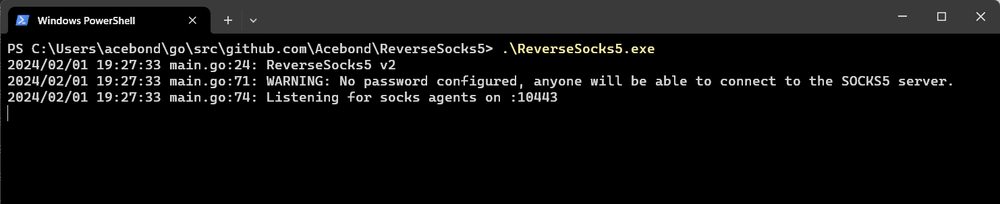
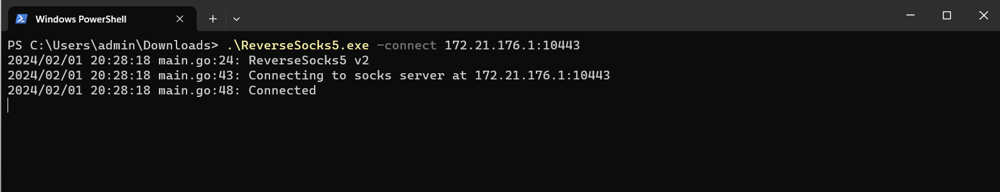

# ReverseSocks5
Reverse SOCKS5 proxy in Golang. Could be useful to bypass firewalls.

## Build
Build with garble to help avoid AV detections, or don't, but Defender will probably destroy the binary and get angry.
```
go install mvdan.cc/garble@latest
garble -tiny build .

# Cross-compile for Linux from Windows
$Env:GOOS = "linux"; $Env:GOARCH = "amd64"; garble -tiny build .
```

## Usage
```
Usage of ReverseSocks5.exe:
  -connect string
        Connect address for socks agent address:port
  -listen string
        Listen address for socks agents address:port (default ":10443")
  -password string
        Password used for SOCKS5 authentication. No authentication required if not configured.
  -psk string
        Pre-shared key for encryption and authentication between the agent and server (default "password")
  -socks string
        Listen address for socks server address:port (default "127.0.0.1:1080")
  -username string
        Username used for SOCKS5 authentication
```

## Start Server

This will open the SOCKS5 port on `127.0.0.1:1080` and listen for an agent on `:10443`. Note the SOCKS5 port will only be accessible once an agent connects.

## Start Agent

This will connect to the server and be the egress point for the SOCKS5 traffic, effectively exposing the internal network of the agent to anyone who can access the SOCKS5 port on the server.
