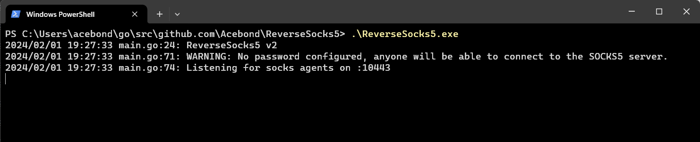
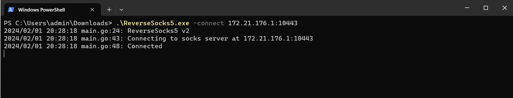
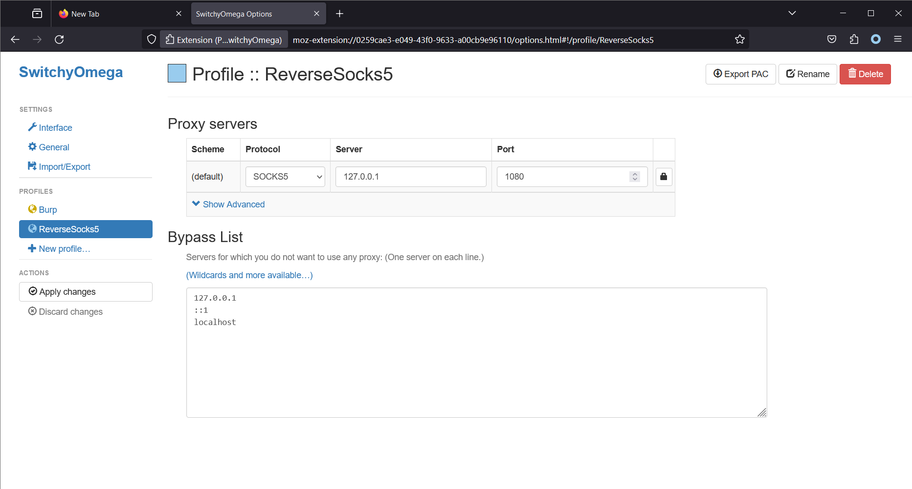

# ReverseSocks5
Reverse SOCKS5 proxy in Golang.

## Usage
```
Usage of ReverseSocks5.exe:
  -cert string
        Certificate file if using TLS on the server
  -connect string
        Connect address for socks agent address:port
  -key string
        Private key file if using TLS on the server
  -listen string
        Listen address for socks agents address:port (default ":10443")
  -password string
        Password used for SOCKS5 authentication. No authentication required if not configured.
  -psk string
        Pre-shared key for encryption and authentication between the agent and server (default "password")
  -socks string
        Listen address for socks server address:port (default "127.0.0.1:1080")
  -tls
        Connect with TLS instead of TCP, the server must be using certificates
  -username string
        Username used for SOCKS5 authentication
```

## Start Server

This will open the SOCKS5 port on `127.0.0.1:1080` and listen for an agent on `:10443`. Note the SOCKS5 port will only be accessible once an agent connects.

## Start Agent

This will connect to the server and be the egress point for the SOCKS5 traffic, effectively exposing the internal network of the agent to anyone who can access the SOCKS5 port on the server.

## Configure a Proxy

Note that Firefox is running on the same machine as the SOCKS5 server. This will cause Firefox (using the Proxy SwitchyOmega extension) to make all connections using the SOCKS5 server. On Linux, a common tool to access the SOCKS5 proxy is `proxychains4`.
